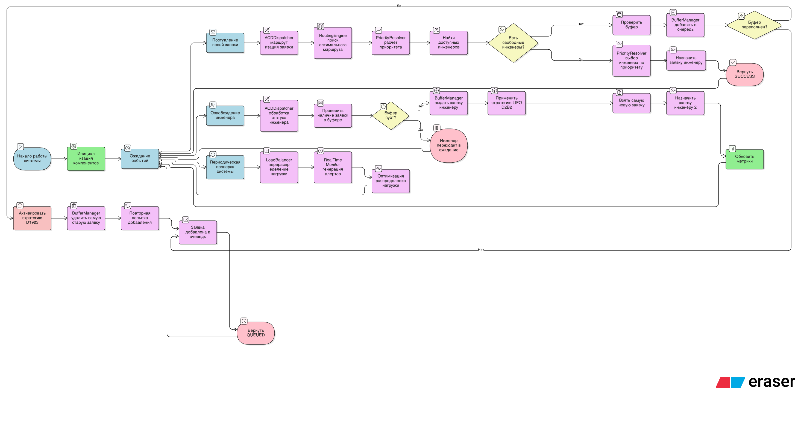

# Курсовая работа по Архитектуре программных систем

**Семенов Александр**  
**Группа: 5130904/30107**

## Описание проекта
Данный репозиторий содержит материалы курсовой работы по моделированию системы массового обслуживания (СМО) для call-центра горячей линии технической поддержки критически важных систем.

## Диаграммы

### 1. Диаграмма классов
  
*Структура классов системы, отображающая основные компоненты и их взаимосвязи*

### 2. Flowchart системы
  
*Блок-схема работы системы, показывающая основные процессы и логику принятия решений*

### 3. Конкуренция инженеров за заявку
.png)  
*Сценарий, когда несколько инженеров одновременно свободны и конкурируют за обработку заявки*

### 4. Нормальное поведение системы  
  
*Диаграмма, демонстрирующая штатную работу системы без срабатывания механизмов отказа*

### 5. Обработка отказа (переполнение буфера)
.png)  
*Сценарий работы системы при переполнении буфера заявок с активацией механизма отказа*
